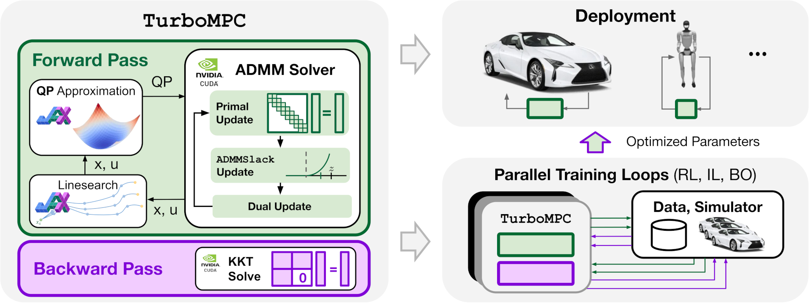

# TurboMPC

## Fast, Scalable, and Differentiable Model Predictive Control on the GPU

This repository contains code for [TurboMPC: Fast, Scalable, and Differentiable Model Predictive Control on the GPU](https://openreview.net/forum?id=u8hZkTX5rs) by Gabriel Bravo-Palacios, Jianghan Zhang, Zachary Pestrikov, Brian Plancher, and Thomas Lew.

TurboMPC uses sequential quadratic programming (SQP), the Alternating Direction Method of Multipliers (ADMM), and different GPU-friendly linear system solvers such as NVIDIA cuDSS to exploit problem structure and enable efficient, batchable, and differentiable solves on the GPU.


## Installation

Tested with Python 3.10+ on Ubuntu 22.04

### CPU-only (no GPU required)

```bash
make install-cpu
source .venv/bin/activate
```

### GPU (CUDA)

Prerequisites: CUDA 12, CMake >= 3.20, and an NVIDIA driver compatible with your CUDA toolkit.

Install into the default in-repo virtual environment:

```bash
make install
source .venv/bin/activate
```

Or install into an existing/shared virtual environment:

```bash
make install VENV=$HOME/myproject/.venv
source $HOME/myproject/.venv/bin/activate
```

`make install` installs Python dependencies, builds CUDA extensions, and
runs `check_install.py`. For manual builds and troubleshooting, see
[docs/build_guide.md](docs/build_guide.md).

## Usage

See [docs/API.md](docs/API.md) for the API, including problem
setup, solver construction, backend selection, warm starts, and
differentiating through MPC solves.

## Examples
For examples on how to use TurboMPC, refer to:

* Drone obstacle avoidance planning example: [examples/drone_obstacles.ipynb](examples/drone_obstacles.ipynb)
* Neural network cost function RL example: [examples/pointmass_rl](examples/pointmass_rl)
* Spacecraft RL example: [examples/RL_spacecraft.ipynb](examples/RL_spacecraft.ipynb)
* Quadrotor RL example: [examples/RL_quadrotor.ipynb](examples/RL_quadrotor.ipynb)

## Benchmarking

Scripts are in [benchmarking](benchmarking/README.md). The
linear-system suite compares TurboMPC, mpc.pytorch, and acados.

## Testing

```bash
source .venv/bin/activate

python -m pytest tests                         # default suite
python -m pytest tests/python                  # CPU/Python subset
python -m pytest tests/cuda                    # CUDA/backend subset
python -m pytest --run-extended tests          # default + extended
python -m pytest --run-extended -m extended tests  # extended only
```

CUDA/FFI tests skip automatically when unavailable.
